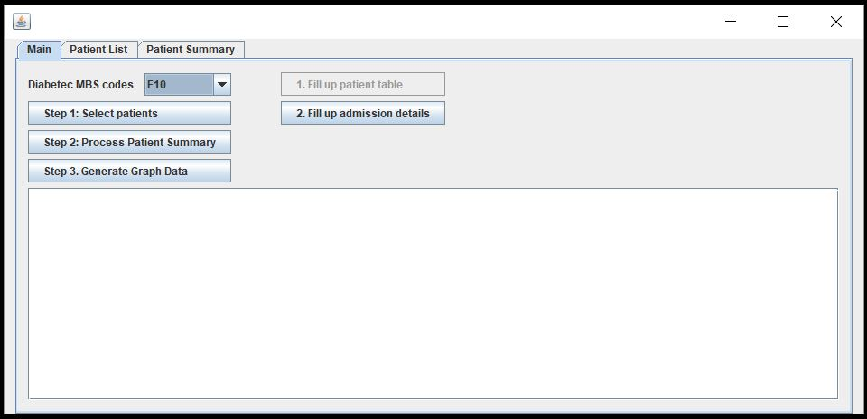

# Introduction

This "Patient Information Processing Demo" software fetches patient records from demo hospital admission data and processes the information on high-level summary.

# Project information
**Author:** Dr Arif Khan 
**Supervisor:** Dr Shahadat Uddin, Dr Uma Srinivasan 
**Language:** Java 
**Built Year:** 2015 
**Technologies/libraries:** *Java*, *MSSQL*, *PostgreSQL*, *Microsoft JDBC Driver for SQL*, *PostgreSQL JDBC Driver*, [JXL API](http://jexcelapi.sourceforge.net/) 
**IDE:** NetBeans IDE 
**License:** MIT

# Description

The software was built as a protype for processing patients' clinical information. It was a precursor for disease risk prediction framework which was later implemented into a separate and more functional software. This software built is titled as "DemoProto" in the NetBeans project - short for "Demo Prototype". 

This software's data input comes from PostgreSQL which contains patient's clinicial information (ICD and MBS codes). User interaction with the software happens in several steps using the buttons on the software. Below are the major steps:

**Select Patient:** The combo-box 'Diabetes MBS codes' contains the ICD codes (without dots) for diabetes. When "Step 1: Select Patients" is clicked, the software fetches the patient information who had the diabetes code in their admission (any time) as specified in the combo box. The patient list is populated in the second tab. 

**Process Patient Summary:** Once clicked, the software takes the patient list generated in the previous step and for each of them, processes the MBS codes for these patients. Cost and other variables (length of stay, total frequency of MBS etc.) associated with the admission is summed over iteratively against each MBS code. Also, at the end of the calculation the result is exported into an Excel file.

**Generate Graph Data:** This generates an excel file which has edge list (source, target, freq) to build a graph where nodes are MBS codes, edges are number of patients that have those two MBS codes. To do this, the software generates all possible MBS code-pairs (that came in previous step) and for each pair search the whole patient list (that came in step 1) to see if they have those MBS codes. An explantion of the resultant graph (disease network) is provided in the reference later in this file.

**Fill Up Patient Table:** Gets the patient list who had the diagnoses code as selected in the combo-box and then saves the patient list (ID, male/female etc.) into a MSSQL database (i.e., into Patient table).

**Fill Up Admission Details:** Gets the current patient list (e.g., from previous step) and populates admission summary for each of them. Saves each admission of each patients into MSSQL database (i.e., into Admission table).

# How to run

The *'DemoProto.jar'* in the *dist* folder can be run from Java. Or you can build from the java source. In reality, you cannot do much apart from understanding the code and home screen since the software needs actual/demo clinical data to run. Unless you configure the databases (Postgres and MSSQL) and populate with correct data, this software cannot do anything fruitful. You can nevertheless build and run it.

# Reference

1. **Khan, A., Uddin, S. and Srinivasan, U.**, Adapting graph theory and social network measures on healthcare data: a new framework to understand chronic disease progression. *In Proceedings of the Australasian Computer Science Week Multiconference*, (2016), ACM, 66.

# Screenshot

